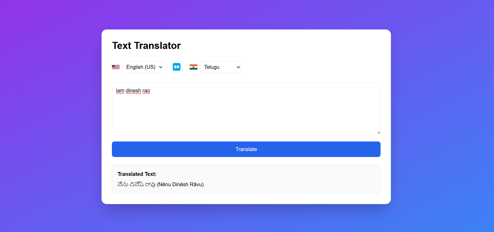

# Text Translator

This is a simple Text Translator web application built using React.js. It allows users to translate text between multiple languages using the Gemini API.

## Features

- Translate text between various languages
- Supports popular languages with country flags
- Swap source and target languages
- Displays translated text in a scrollable area
- Responsive and user-friendly UI

## Technologies Used

- React.js
- Tailwind CSS
- Gemini API

## Screenshots



## Installation

1. Clone the repository:
    ```bash
    git clone https://github.com/pidadhdinesh/translator.git
    ```
2. Navigate to the project directory:
    ```bash
    cd translator
    ```
3. Install dependencies:
    ```bash
    npm install
    ```

## Usage

1. Start the development server:
    ```bash
    npm start
    ```
2. Open your browser and go to `http://localhost:3000`

## Configuration

1. Update your Gemini API key in the code at `Translator.js`:
    ```javascript
    const apiKey = 'YOUR_API_KEY';
    ```


### Note
Make sure to replace `YOUR_API_KEY` with your actual Gemini API key and update the image path in the `assets` folder with the correct screenshot f
